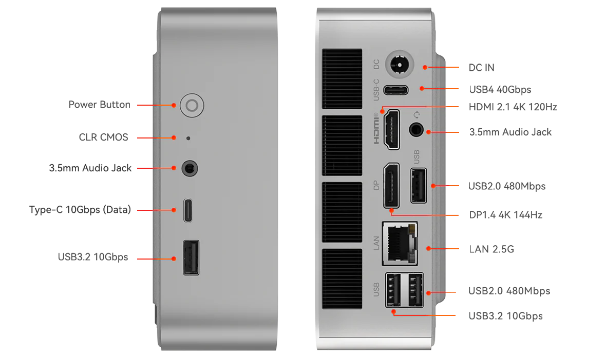

# Configure Proxmox on 7845HS
This repo is created to document the configuration of the Proxmox server on 7845HS, specifically on Beelink SER-8 96G.

## Ports
Beelink has a bit illogical port layout so I kept forgetting where USB 2.0 are to avoid them, the following is the port layout.


## BIOS
The main idea is to to make sure IOMMU is enabled
(TBD: Will attach photo of the BIOS)

## Proxmox Host Configuration
Configs are stored in [./proxmox-configs](proxmox) 

### Grub
After multiple iterations this is the [grub config](./proxmox/grub) that currently works on my host.

### VM BIOS Files
We'll need to dump/download original bios for a video card and for audio component.
#### Direct Links for 7845HS
- [vbios_8745hs.bin](https://github.com/isc30/ryzen-gpu-passthrough-proxmox/blob/main/vbios_8745hs.bin)
- [AMDGopDriver_8745hs.rom](https://github.com/isc30/ryzen-gpu-passthrough-proxmox/blob/main/AMDGopDriver_8745hs.rom)
Place them on your Proxmox to `/usr/share/kvm/`:
```shell
cd /usr/share/kvm/
wget https://github.com/isc30/ryzen-gpu-passthrough-proxmox/blob/main/vbios_8745hs.bin
wget https://github.com/isc30/ryzen-gpu-passthrough-proxmox/blob/main/AMDGopDriver_8745hs.rom 
```

#### Further Reading
Huge kudos to [isc30](https://github.com/isc30) for the [ryzen-gpu-passthrough-proxmox](https://github.com/isc30/ryzen-gpu-passthrough-proxmox) repo. 
Tremendous amount of work and this setup would not have been possible without it!

### Windows VM Configuration
Current config used is [vm.conf](proxmox/qemu-server/vm.conf). Make sure to place it under a correct id (ie `100.conf`).

#### (Not needed anymore) VM Lifecycle Wrappers
Initially it was required, but now it seems to be working fine without out.
Since the GPU has a bug that causes the system to freeze, a [script](snippets/resetpcie.sh) is created to reset the GPU during certain lifecycle events.
Place it under _/var/lib/vz/snippets/resetpcie.sh_ on your Proxmox host.


## Windows OS Configuration
### Boostrap
Use snippets from [boostrap.ps1](./windows10-guest/boostrap.ps1) to bootstrap your Windows Environment. 
Some of it is meant to be executed in the user shell and some in the admin shell.  

### Reconnect Screen
I use Windows Remote Desktop frequently and need my Monitor/TV to reconnect back after I disconnect from the RDP.
Use [reconnectScreen.ps1](./windows10-guest/reconnectScreen.ps1) to configure reconnect the screen. 
There is some a bug which I can't catch yet, if you can find it feel free to submit PR

### Disable Safe Mode
Sometimes when Windows wasn't restarted cleanly (say forefully via Proxmox) it reboots into a safe mode by default.
Use [disableSafeMode.cmd](./windows10-guest/disableSafeMode.cmd) to:
1. Add a dedicated safe mode boot option
2. Make it non-default.

### Radeon Reset Bug Fix Service
Install [RadeonResetBugFix](https://github.com/inga-lovinde/RadeonResetBugFix) which would help with an issue when restarting VM locks the eGPU. 

### Troubleshooting
For troubleshooting commands see [CHEAT-SHEET.md](CHEAT-SHEET.md)

---
## References
- [Guide how to sideload AMD 780M graphics driver](https://www.reddit.com/r/LegionGo/comments/1b7bee0/guide_how_to_sideload_amd_780m_graphics_driver/)
- [isc30/ryzen-gpu-passthrough-proxmox](https://github.com/isc30/ryzen-gpu-passthrough-proxmox)
- [Install Non-Free Firmware on PVE 8 with no Meta Package - Proxmox VE](https://forum.proxmox.com/threads/install-non-free-firmware-on-pve-8-without-removing-meta-package-proxmox-ve.134675/post-595143)
- [Bios config](https://www.redditmedia.com/r/BeelinkOfficial/comments/1itp2n5/beelink_ser8_tweak_guide_100_safe_no_overclocking/)
