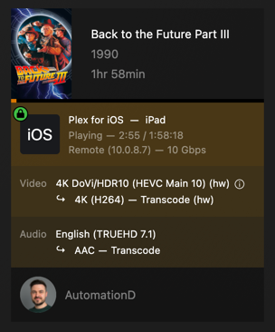

# Troubleshooting HW Decoding/Encoding

I had to update plex and let it redownload codecs https://forums.plex.tv/t/a-required-codec-could-not-be-found-or-failed-to-install/905580/24
## Plex Bundled ffmpeg
### Version
```shell
"c:\Program Files\Plex\Plex Media Server\Plex Transcoder.exe" -version
```

```log
ffmpeg version e613bce-97f23d579c1001d8e9cc0d2e Copyright (c) 2000-2022 the FFmpeg developers
built with Plex clang version 11.0.1 (https://plex.tv 9b997da8e5b47bdb4a9425b3a3b290be393b4b1f)
configuration: --disable-static --enable-shared --disable-libx264 --disable-hwaccels --disable-protocol=concat --external-decoder=h264 --enable-debug --enable-muxers --enable-libxml2 --enable-mediafoundation --fatal-warnings --disable-gmp --disable-avdevice --disable-bzlib --disable-sdl2 --disable-decoders --disable-devices --disable-encoders --disable-ffprobe --disable-ffplay --disable-doc --disable-iconv --disable-lzma --disable-schannel --disable-linux-perf --disable-mediacodec --enable-eae --disable-protocol='udp,udplite' --arch=x86_64 --target-os=mingw64 --strip=true --cc=x86_64-w64-mingw32-clang --pkg-config=/home/runner/actions-runner/_work/plex-conan/plex-conan/plexconantool/plex-pkg-config --pkg-config-flags=--static --windres=x86_64-w64-mingw32-windres --enable-cuda-llvm --enable-opencl --cross-prefix=llvm- --enable-cross-compile --ar=llvm-ar --nm=llvm-nm --ranlib=llvm-ranlib --enable-w32threads --enable-libvpl --extra-ldflags='-m64 -L/home/runner/actions-runner/_work/plex-conan/plex-conan/.conan/data/opus/1.2.1-35/plex/main/package/62802295b606f2fd9b9cdafbd24b7f71e361809b/lib -L/home/runner/actions-runner/_work/plex-conan/plex-conan/.conan/data/libvorbis/1.3.5-39/plex/main/package/2cdf21fa7639ca27f99a72f85485f3363835edf2/lib -L/home/runner/actions-runner/_work/plex-conan/plex-conan/.conan/data/libxml2/2.9.11-e1bcffea-14/plex/main/package/602127a3e58dc96b71ea6b80164ed4efc41e5d87/lib -L/home/runner/actions-runner/_work/plex-conan/plex-conan/.conan/data/dav1d/1.0.0-15/plex/main/package/0a0761ca196feaa75e73e73fa01a8741f715d19f/lib -L/home/runner/actions-runner/_work/plex-conan/plex-conan/.conan/data/ffnvcodec/11.0.10.3-a62a66f-2/plex/main/package/5ab84d6acfe1f23c4fae0ab88f26e3a396351ac9/lib -L/home/runner/actions-runner/_work/plex-conan/plex-conan/.conan/data/openssl/3.1.1-2cf4e90-1/plex/main/package/e8e821d49deace0dbcff7823727a308775c78765/lib -L/home/runner/actions-runner/_work/plex-conan/plex-conan/.conan/data/libvpl/2.10.1-79ef61b-0/plex/main/package/2fc7152f95d5c44b09c82ef6992cd38160235fcf/lib -L/home/runner/actions-runner/_work/plex-conan/plex-conan/.conan/data/x264/161-1086f45-30/plex/main/package/62802295b606f2fd9b9cdafbd24b7f71e361809b/lib -L/home/runner/actions-runner/_work/plex-conan/plex-conan/.conan/data/zvbi/0.2.35-61/plex/main/package/71da9ceca0dd53c77af42820a01fdc10d850e1fa/lib -L/home/runner/actions-runner/_work/plex-conan/plex-conan/.conan/data/libass/0.17.3-1/plex/main/package/9961f84620d255a3497c784932bb0c1e7308a5a0/lib -L/home/runner/actions-runner/_work/plex-conan/plex-conan/.conan/data/mp3lame/3.98.4-34/plex/main/package/62802295b606f2fd9b9cdafbd24b7f71e361809b/lib -L/home/runner/actions-runner/_work/plex-conan/plex-conan/.conan/data/opencl-runtime-loader/0.0.1-739ae8d-21/plex/main/package/bff95ad44a9148715a6ff47eb07dcc3eab8f68b7/lib -L/home/runner/actions-runner/_work/plex-conan/plex-conan/.conan/data/libogg/1.3.2-35/plex/main/package/62802295b606f2fd9b9cdafbd24b7f71e361809b/lib -L/home/runner/actions-runner/_work/plex-conan/plex-conan/.conan/data/winpthread/1.0-8/plex/main/package/7f7ae90ff42e2037452ed5e83bd0408a557c0cea/lib -L/home/runner/actions-runner/_work/plex-conan/plex-conan/.conan/data/iconv/1.16-33/plex/main/package/8b74fe8914765b63114c69ce4f0958f64a3a5744/lib -L/home/runner/actions-runner/_work/plex-conan/plex-conan/.conan/data/fribidi/1.0.12-3/plex/main/package/7f7ae90ff42e2037452ed5e83bd0408a557c0cea/lib -L/home/runner/actions-runner/_work/plex-conan/plex-conan/.conan/data/harfbuzz/4.2.1-6/plex/main/package/c868cc4d37736b45c7bf3dbd1d8fd727da06977e/lib -L/home/runner/actions-runner/_work/plex-conan/plex-conan/.conan/data/freetype2/2.12.1-27/plex/main/package/c1e8d438e8f1b0edc3985f699fab13717fb769cb/lib -L/home/runner/actions-runner/_work/plex-conan/plex-conan/.conan/data/bzip2/1.0.6-39/plex/main/package/0a0b6bc3350c1d10b15d4234156ddb65b242a2bb/lib -L/home/runner/actions-runner/_work/plex-conan/plex-conan/.conan/data/libpng/1.6.37-42/plex/main/package/559d3f8c61bf6b36ad1feb2464d56e96cf145ea2/lib -L/home/runner/actions-runner/_work/plex-conan/plex-conan/.conan/data/zlib/1.2.11-33/plex/main/package/62802295b606f2fd9b9cdafbd24b7f71e361809b/lib -Wl,--gc-sections -g2 -Wl,--pdb= -flto=thin -fwhole-program-vtables -Wl,-O2 -Wl,--thinlto-cache-dir=/home/runner/actions-runner/_work/plex-conan/plex-conan/.conan/data/ffmpeg/2.0-e613bce65a-1/plex/main/build/c09dc10fe2916c2613a2fdb58d7e38639fb9f407/lto_cache/' --extra-libs=' -lwinmm -lwsock32 -lcrypt32 -luuid' --enable-decoder=png --enable-decoder=apng --enable-decoder=bmp --enable-decoder=mjpeg --enable-decoder=thp --enable-decoder=gif --enable-decoder=dirac --enable-decoder=ffv1 --enable-decoder=ffvhuff --enable-decoder=huffyuv --enable-decoder=libdav1d --enable-decoder=av1 --enable-decoder=rawvideo --enable-decoder=zero12v --enable-decoder=ayuv --enable-decoder=r210 --enable-decoder=v210 --enable-decoder=v210x --enable-decoder=v308 --enable-decoder=v408 --enable-decoder=v410 --enable-decoder=y41p --enable-decoder=yuv4 --enable-decoder=ansi --enable-decoder=alac --enable-decoder=flac --enable-decoder=vorbis --enable-decoder=opus --enable-decoder=pcm_f32be --enable-decoder=pcm_f32le --enable-decoder=pcm_f64be --enable-decoder=pcm_f64le --enable-decoder=pcm_lxf --enable-decoder=pcm_s16be --enable-decoder=pcm_s16be_planar --enable-decoder=pcm_s16le --enable-decoder=pcm_s16le_planar --enable-decoder=pcm_s24be --enable-decoder=pcm_s24le --enable-decoder=pcm_s24le_planar --enable-decoder=pcm_s32be --enable-decoder=pcm_s32le --enable-decoder=pcm_s32le_planar --enable-decoder=pcm_s8 --enable-decoder=pcm_s8_planar --enable-decoder=pcm_u16be --enable-decoder=pcm_u16le --enable-decoder=pcm_u24be --enable-decoder=pcm_u24le --enable-decoder=pcm_u32be --enable-decoder=pcm_u32le --enable-decoder=pcm_u8 --enable-decoder=pcm_alaw --enable-decoder=pcm_mulaw --enable-decoder=ass --enable-decoder=dvbsub --enable-decoder=dvdsub --enable-decoder=ccaption --enable-decoder=pgssub --enable-decoder=jacosub --enable-decoder=microdvd --enable-decoder=movtext --enable-decoder=mpl2 --enable-decoder=pjs --enable-decoder=realtext --enable-decoder=sami --enable-decoder=ssa --enable-decoder=stl --enable-decoder=subrip --enable-decoder=subviewer --enable-decoder=text --enable-decoder=vplayer --enable-decoder=webvtt --enable-decoder=xsub --enable-decoder=eac3_mf --enable-decoder=wmalossless_mf --enable-decoder=wmapro_mf --enable-decoder=wmav1_mf --enable-decoder=wmav2_mf --enable-decoder=wmavoice_mf --enable-decoder=eac3_eae --enable-decoder=truehd_eae --enable-decoder=mlp_eae --enable-encoder=flac --enable-encoder=alac --enable-encoder=libvorbis --enable-encoder=libopus --enable-encoder=mjpeg --enable-encoder=png --enable-encoder=rawvideo --enable-encoder=wrapped_avframe --enable-encoder=ass --enable-encoder=dvbsub --enable-encoder=dvdsub --enable-encoder=movtext --enable-encoder=ssa --enable-encoder=subrip --enable-encoder=text --enable-encoder=webvtt --enable-encoder=xsub --enable-encoder=pcm_f32be --enable-encoder=pcm_f32le --enable-encoder=pcm_f64be --enable-encoder=pcm_f64le --enable-encoder=pcm_s8 --enable-encoder=pcm_s8_planar --enable-encoder=pcm_s16be --enable-encoder=pcm_s16be_planar --enable-encoder=pcm_s16le --enable-encoder=pcm_s16le_planar --enable-encoder=pcm_s24be --enable-encoder=pcm_s24le --enable-encoder=pcm_s24le_planar --enable-encoder=pcm_s32be --enable-encoder=pcm_s32le --enable-encoder=pcm_s32le_planar --enable-encoder=pcm_u8 --enable-encoder=pcm_u16be --enable-encoder=pcm_u16le --enable-encoder=pcm_u24be --enable-encoder=pcm_u24le --enable-encoder=pcm_u32be --enable-encoder=pcm_u32le --enable-encoder=aac_mf --enable-encoder=h264_qsv --enable-encoder=hevc_qsv --enable-encoder=h264_nvenc --enable-encoder=hevc_nvenc --enable-encoder=h264_mf --enable-encoder=hevc_mf --enable-encoder=eac3_eae --enable-hwaccel=av1_nvdec --prefix=/home/runner/actions-runner/_work/plex-conan/plex-conan/.conan/data/ffmpeg/2.0-e613bce65a-1/plex/main/build/c09dc10fe2916c2613a2fdb58d7e38639fb9f407/transcoder-install --enable-libzvbi --enable-openssl --enable-libass --enable-libopus --enable-libvorbis --enable-libdav1d --extra-cflags='-m64 -O3 -fdata-sections -ffunction-sections -fno-omit-frame-pointer -g2 -gdwarf-4 -fcommon -gcodeview -flto=thin -fwhole-program-vtables -I/home/runner/actions-runner/_work/plex-conan/plex-conan/.conan/data/opus/1.2.1-35/plex/main/package/62802295b606f2fd9b9cdafbd24b7f71e361809b/include -I/home/runner/actions-runner/_work/plex-conan/plex-conan/.conan/data/libvorbis/1.3.5-39/plex/main/package/2cdf21fa7639ca27f99a72f85485f3363835edf2/include -I/home/runner/actions-runner/_work/plex-conan/plex-conan/.conan/data/libxml2/2.9.11-e1bcffea-14/plex/main/package/602127a3e58dc96b71ea6b80164ed4efc41e5d87/include -I/home/runner/actions-runner/_work/plex-conan/plex-conan/.conan/data/libxml2/2.9.11-e1bcffea-14/plex/main/package/602127a3e58dc96b71ea6b80164ed4efc41e5d87/include/libxml2 -I/home/runner/actions-runner/_work/plex-conan/plex-conan/.conan/data/dav1d/1.0.0-15/plex/main/package/0a0761ca196feaa75e73e73fa01a8741f715d19f/include -I/home/runner/actions-runner/_work/plex-conan/plex-conan/.conan/data/ffnvcodec/11.0.10.3-a62a66f-2/plex/main/package/5ab84d6acfe1f23c4fae0ab88f26e3a396351ac9/include -I/home/runner/actions-runner/_work/plex-conan/plex-conan/.conan/data/openssl/3.1.1-2cf4e90-1/plex/main/package/e8e821d49deace0dbcff7823727a308775c78765/include -I/home/runner/actions-runner/_work/plex-conan/plex-conan/.conan/data/libvpl/2.10.1-79ef61b-0/plex/main/package/2fc7152f95d5c44b09c82ef6992cd38160235fcf/include -I/home/runner/actions-runner/_work/plex-conan/plex-conan/.conan/data/x264/161-1086f45-30/plex/main/package/62802295b606f2fd9b9cdafbd24b7f71e361809b/include -I/home/runner/actions-runner/_work/plex-conan/plex-conan/.conan/data/zvbi/0.2.35-61/plex/main/package/71da9ceca0dd53c77af42820a01fdc10d850e1fa/include -I/home/runner/actions-runner/_work/plex-conan/plex-conan/.conan/data/libass/0.17.3-1/plex/main/package/9961f84620d255a3497c784932bb0c1e7308a5a0/include -I/home/runner/actions-runner/_work/plex-conan/plex-conan/.conan/data/mp3lame/3.98.4-34/plex/main/package/62802295b606f2fd9b9cdafbd24b7f71e361809b/include -I/home/runner/actions-runner/_work/plex-conan/plex-conan/.conan/data/libogg/1.3.2-35/plex/main/package/62802295b606f2fd9b9cdafbd24b7f71e361809b/include -I/home/runner/actions-runner/_work/plex-conan/plex-conan/.conan/data/iconv/1.16-33/plex/main/package/8b74fe8914765b63114c69ce4f0958f64a3a5744/include -I/home/runner/actions-runner/_work/plex-conan/plex-conan/.conan/data/fribidi/1.0.12-3/plex/main/package/7f7ae90ff42e2037452ed5e83bd0408a557c0cea/include -I/home/runner/actions-runner/_work/plex-conan/plex-conan/.conan/data/harfbuzz/4.2.1-6/plex/main/package/c868cc4d37736b45c7bf3dbd1d8fd727da06977e/include/harfbuzz -I/home/runner/actions-runner/_work/plex-conan/plex-conan/.conan/data/opencl-headers/v2024.05.08-8275634-0/plex/main/package/5ab84d6acfe1f23c4fae0ab88f26e3a396351ac9/include -I/home/runner/actions-runner/_work/plex-conan/plex-conan/.conan/data/freetype2/2.12.1-27/plex/main/package/c1e8d438e8f1b0edc3985f699fab13717fb769cb/include -I/home/runner/actions-runner/_work/plex-conan/plex-conan/.conan/data/bzip2/1.0.6-39/plex/main/package/0a0b6bc3350c1d10b15d4234156ddb65b242a2bb/include -I/home/runner/actions-runner/_work/plex-conan/plex-conan/.conan/data/libpng/1.6.37-42/plex/main/package/559d3f8c61bf6b36ad1feb2464d56e96cf145ea2/include -I/home/runner/actions-runner/_work/plex-conan/plex-conan/.conan/data/zlib/1.2.11-33/plex/main/package/62802295b606f2fd9b9cdafbd24b7f71e361809b/include -DFRIBIDI_LIB_STATIC -DLIBXML_STATIC -DNDEBUG'
libavutil      57. 24.101 / 57. 24.101
libavcodec     59. 25.100 / 59. 25.100
libavformat    59. 20.101 / 59. 20.101
libavfilter     8. 29.100 /  8. 29.100
libswscale      6.  6.100 /  6.  6.100
libswresample   4.  6.100 /  4.  6.100
```

### Codec
```shell
"c:\Program Files\Plex\Plex Media Server\Plex Transcoder.exe" -codecs | findstr /I "hevc"
```

```log
 .EV.L. hevc                 H.265 / HEVC (High Efficiency Video Coding) (encoders: hevc_mf hevc_nvenc hevc_qsv )
```


## OpenSource ffmpeg (via scoop)
```shell
ffmpeg -version
```

```log
ffmpeg -version
ffmpeg version 7.1-full_build-www.gyan.dev Copyright (c) 2000-2024 the FFmpeg developers
built with gcc 14.2.0 (Rev1, Built by MSYS2 project)
configuration: --enable-gpl --enable-version3 --enable-static --disable-w32threads --disable-autodetect --enable-fontconfig --enable-iconv --enable-gnutls --enable-libxml2 --enable-gmp --enable-bzlib --enable-lzma --enable-libsnappy --enable-zlib --enable-librist --enable-libsrt --enable-libssh --enable-libzmq --enable-avisynth --enable-libbluray --enable-libcaca --enable-sdl2 --enable-libaribb24 --enable-libaribcaption --enable-libdav1d --enable-libdavs2 --enable-libopenjpeg --enable-libquirc --enable-libuavs3d --enable-libxevd --enable-libzvbi --enable-libqrencode --enable-librav1e --enable-libsvtav1 --enable-libvvenc --enable-libwebp --enable-libx264 --enable-libx265 --enable-libxavs2 --enable-libxeve --enable-libxvid --enable-libaom --enable-libjxl --enable-libvpx --enable-mediafoundation --enable-libass --enable-frei0r --enable-libfreetype --enable-libfribidi --enable-libharfbuzz --enable-liblensfun --enable-libvidstab --enable-libvmaf --enable-libzimg --enable-amf --enable-cuda-llvm --enable-cuvid --enable-dxva2 --enable-d3d11va --enable-d3d12va --enable-ffnvcodec --enable-libvpl --enable-nvdec --enable-nvenc --enable-vaapi --enable-libshaderc --enable-vulkan --enable-libplacebo --enable-opencl --enable-libcdio --enable-libgme --enable-libmodplug --enable-libopenmpt --enable-libopencore-amrwb --enable-libmp3lame --enable-libshine --enable-libtheora --enable-libtwolame --enable-libvo-amrwbenc --enable-libcodec2 --enable-libilbc --enable-libgsm --enable-liblc3 --enable-libopencore-amrnb --enable-libopus --enable-libspeex --enable-libvorbis --enable-ladspa --enable-libbs2b --enable-libflite --enable-libmysofa --enable-librubberband --enable-libsoxr --enable-chromaprint
libavutil      59. 39.100 / 59. 39.100
libavcodec     61. 19.100 / 61. 19.100
libavformat    61.  7.100 / 61.  7.100
libavdevice    61.  3.100 / 61.  3.100
libavfilter    10.  4.100 / 10.  4.100
libswscale      8.  3.100 /  8.  3.100
libswresample   5.  3.100 /  5.  3.100
libpostproc    58.  3.100 / 58.  3.100
```

### Codec
```shell
ffmpeg -codecs | findstr /I "hevc"
```

```log
DEV.L. hevc                 H.265 / HEVC (High Efficiency Video Coding) (decoders: hevc hevc_qsv hevc_cuvid) (encoders: libx265 hevc_amf hevc_d3d12va hevc_mf hevc_nvenc hevc_qsv hevc_vaapi hevc_vulkan)
```
