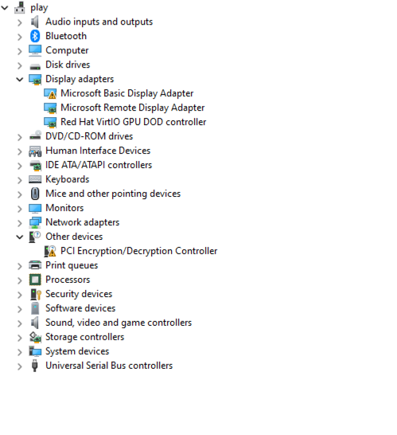
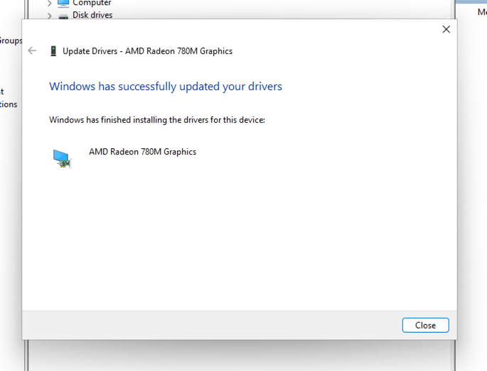
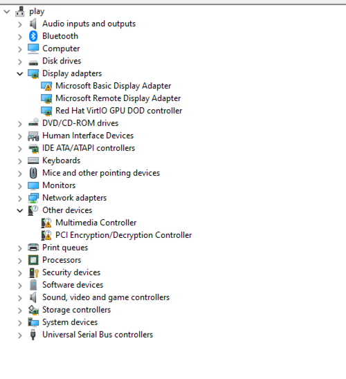
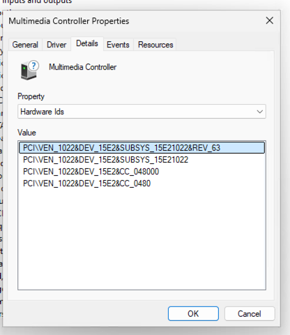
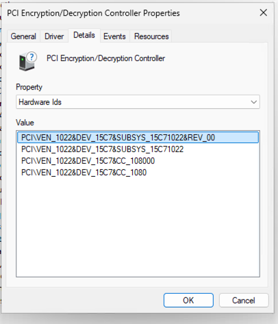
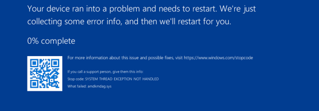

# Troubleshooting Log

## Goal: Start without devices
- [x] Disable automatic recovery mode
- [x] Remove drivers again
- [x] Restart to make sure things are running fine
- [x] Stop

## Add back the devices
- [x] Disable Virtual GPU (Display = none, or `vga=none`)
- [x] Set "Primary Display" (`x-vga=1`) on the `0000:66:00.0` device
- [x] Fresh boot Boot into a regular Desktop (no drivers working yet)
- [x] Check that the only adapter is "Microsoft Basic Display Adapter"
- [x] Notice there is no sound with default windows drier
- [x] Shutdown and attach `66:00.5` and `66:00.6`
- [x] Boot again
    - [x] Notice sound adjustment is acecssible but still no sound.
    - [x] Shutdown
    - [x] Add `1022:15c7` (`0000:66:00.2`) to the vm
- [x] Boot again
    - [x] No immediate crash
    - [x] Devices noticed (no drivers yet)
        - Multimedia Controller
        - PCI Encrpytion/Decryption Controller
    - [x] Enable System Protection in Windows, create restore point
    - [ ] Run the drivers installer
        - [x] Run installer `Adrenalin 25.2.1`
        - VM shows black screen
        - Proxmox host is still running
        - Seems like some of the USB devices on the 66:00* can't be reset. Will try to passthrough the whole USB controller
    - [x] Remove all video devices
    - [x] Add virtio driver back
- [x] Boot again
    - Clean up drivers
    - Shutdown
- [ ] Start again
    - [x] Enable GPU Reset Bugfix (so it releeases gpu when VM is stopped via OS)
        - [X] Test shutdown
            - Didn't work. Test next with `shutdown /s /t 0`
    - [ ] Try attaching `66:00.5` and `66:00.6`, add it to the bind/unbind logic
    - [ ] Run the drivers installer again
    - [ ] Run installer `Adrenalin 24.x.x`
- [x] Add .3 and .4
- [x] Update resetpcie.sh to add more devices but no .4 and .6
- [x] Multiple restarts: no crash of the vm/host. Devices seem to be attached/detached properly
- [x] Add drivers via Control panel
    - After restart they didn't install automatically. Maybe switch to a GPU needed? (check next)
    - 
- 
## Install Drivers
- [x] Run `whql-amd-software-adrenalin-edition-24.8.1-win10-win11-aug-rdna` installer
    - "OOPS, something went wrong" (installer couldn't start)
- [x] Run `whql-amd-software-adrenalin-edition-24.12.xxx installer
    - 
- [x] Try Beelink [22.8.1](https://dr.bee-link.cn/?dir=uploads%2FSER%2FSER8-8745%2FDriver) driver
    - VM restarted but no crash. Driver doesn't seem to be installed.
    - Clicked "Update driver", "Search automatically", got
        - 
- [x] Disabled GPU (none), reboot tried RDP, no connection
- [x] Try dumping GPU bios again
- [x] Install Beelink-ser8 supplied driver
    - select "full install"
    - Don't mark the "Reset" checkbox
    - ...Got `Windows has stopped this device because it has reported problems. (Code 43)` error
    - Suspicion, AMDGop driver is incorrect?
- [ ] Dump the AMDGop driver from the vbios dumped?
- [x] Verify "4G" is disabled in the BIOS

## Goal: Try to add as many devices under 0000:66:00 as possible without crashing.
### Add all devices
Added 0-5. Disabled post-stop cleanup.
Clean Start: OK (the only issue is it starts in safe mode, need `wpeutil reboot` to boot into Windows)
Added 6 (post-stop cleanup disabled)
Clean Start: OK

### Check Hard Restart
Restart (`qm stop 101 && qm start 101`): crash
Stop & check devices status
Start: OK, but int safe mode
Run cmd `wpeutil reboot`
Boot into Windows: OK

### Check Soft Restart
Soft restart (Start -> restart): OK, RDP OK

### Check pci devices
#### All devices are attached to `vfio-pci`
```shell
pcilib: Error reading /sys/bus/pci/devices/0000:00:08.3/label: Operation not permitted
66:00.0 VGA compatible controller [0300]: Advanced Micro Devices, Inc. [AMD/ATI] Phoenix3 [1002:1900] (rev b3)
Subsystem: Device [1f66:0031]
Kernel driver in use: vfio-pci
Kernel modules: amdgpu
66:00.1 Audio device [0403]: Advanced Micro Devices, Inc. [AMD/ATI] Rembrandt Radeon High Definition Audio Controller [1002:1640]
Subsystem: Advanced Micro Devices, Inc. [AMD/ATI] Rembrandt Radeon High Definition Audio Controller [1002:1640]
Kernel driver in use: vfio-pci
Kernel modules: snd_hda_intel
66:00.2 Encryption controller [1080]: Advanced Micro Devices, Inc. [AMD] Phoenix CCP/PSP 3.0 Device [1022:15c7]
Subsystem: Advanced Micro Devices, Inc. [AMD] Phoenix CCP/PSP 3.0 Device [1022:15c7]
Kernel driver in use: vfio-pci
Kernel modules: ccp
66:00.3 USB controller [0c03]: Advanced Micro Devices, Inc. [AMD] Device [1022:15b9]
Subsystem: Advanced Micro Devices, Inc. [AMD] Device [1022:15b9]
Kernel driver in use: vfio-pci
Kernel modules: xhci_pci
66:00.4 USB controller [0c03]: Advanced Micro Devices, Inc. [AMD] Device [1022:15ba]
Subsystem: Advanced Micro Devices, Inc. [AMD] Device [1022:15b9]
Kernel driver in use: vfio-pci
Kernel modules: xhci_pci
66:00.5 Multimedia controller [0480]: Advanced Micro Devices, Inc. [AMD] ACP/ACP3X/ACP6x Audio Coprocessor [1022:15e2] (rev 63)
Subsystem: Advanced Micro Devices, Inc. [AMD] ACP/ACP3X/ACP6x Audio Coprocessor [1022:15e2]
Kernel driver in use: vfio-pci
Kernel modules: snd_pci_acp3x, snd_rn_pci_acp3x, snd_pci_acp5x, snd_pci_acp6x, snd_acp_pci, snd_rpl_pci_acp6x, snd_pci_ps, snd_sof_amd_renoir, snd_sof_amd_rembrandt, snd_sof_amd_vangogh, snd_sof_amd_acp63
66:00.6 Audio device [0403]: Advanced Micro Devices, Inc. [AMD] Family 17h/19h HD Audio Controller [1022:15e3]
DeviceName: Realtek ALC256
Subsystem: Device [1f66:0202]
Kernel driver in use: vfio-pci
```

#### IOMMU Groups are still isolated
```shell
IOMMU Group 19 66:00.0 VGA compatible controller [0300]: Advanced Micro Devices, Inc. [AMD/ATI] Phoenix3 [1002:1900] (rev b3)
IOMMU Group 20 66:00.1 Audio device [0403]: Advanced Micro Devices, Inc. [AMD/ATI] Rembrandt Radeon High Definition Audio Controller [1002:1640]
IOMMU Group 21 66:00.2 Encryption controller [1080]: Advanced Micro Devices, Inc. [AMD] Phoenix CCP/PSP 3.0 Device [1022:15c7]
IOMMU Group 22 66:00.3 USB controller [0c03]: Advanced Micro Devices, Inc. [AMD] Device [1022:15b9]
IOMMU Group 23 66:00.4 USB controller [0c03]: Advanced Micro Devices, Inc. [AMD] Device [1022:15ba]
IOMMU Group 24 66:00.5 Multimedia controller [0480]: Advanced Micro Devices, Inc. [AMD] ACP/ACP3X/ACP6x Audio Coprocessor [1022:15e2] (rev 63)
IOMMU Group 25 66:00.6 Audio device [0403]: Advanced Micro Devices, Inc. [AMD] Family 17h/19h HD Audio Controller [1022:15e3]
```
#### Windows Device Manager has some new devices

**Multimedia Controller 66:00.5 [1022:15e2]**

**Encryption Controller 66:00.2 [1022:15c7]**



### Interim Conclusion
All devices are forwarded properly, but the issue is with the detachment/re-attachment

## Goal: Find a reason of crash on a secondary start (after a `qm stop`)
```shell
qm stop 101
```
### JournalD
```log
Feb 26 10:08:39 pve qm[4656]: pre-stop: VM 101
Feb 26 10:08:39 pve kernel: tap101i0: left allmulticast mode
Feb 26 10:08:39 pve kernel: fwbr101i0: port 2(tap101i0) entered disabled state
Feb 26 10:08:39 pve kernel: fwbr101i0: port 1(fwln101i0) entered disabled state
Feb 26 10:08:39 pve kernel: vmbr0: port 3(fwpr101p0) entered disabled state
Feb 26 10:08:39 pve kernel: fwln101i0 (unregistering): left allmulticast mode
Feb 26 10:08:39 pve kernel: fwln101i0 (unregistering): left promiscuous mode
Feb 26 10:08:39 pve kernel: fwbr101i0: port 1(fwln101i0) entered disabled state
Feb 26 10:08:39 pve kernel: fwpr101p0 (unregistering): left allmulticast mode
Feb 26 10:08:39 pve kernel: fwpr101p0 (unregistering): left promiscuous mode
Feb 26 10:08:39 pve kernel: vmbr0: port 3(fwpr101p0) entered disabled state
Feb 26 10:08:40 pve qmeventd[908]: read: Connection reset by peer
Feb 26 10:08:40 pve qmeventd[4684]: Starting cleanup for 101
Feb 26 10:08:40 pve qmeventd[4684]: trying to acquire lock...
Feb 26 10:08:40 pve systemd[1]: 101.scope: Deactivated successfully.
░░ Subject: Unit succeeded
░░ Defined-By: systemd
░░ Support: https://www.debian.org/support
░░
░░ The unit 101.scope has successfully entered the 'dead' state.
Feb 26 10:08:40 pve systemd[1]: 101.scope: Consumed 19min 6.132s CPU time.
░░ Subject: Resources consumed by unit runtime
░░ Defined-By: systemd
░░ Support: https://www.debian.org/support
░░
░░ The unit 101.scope completed and consumed the indicated resources.
Feb 26 10:08:41 pve qmeventd[4684]:  OK
Feb 26 10:08:41 pve qm[4651]: <root@pam> end task UPID:pve:0000122C:0001BCCC:67BECC07:qmstop:101:root@pam: OK
Feb 26 10:08:41 pve qmeventd[4684]: post-stop: VM 101
Feb 26 10:08:41 pve qmeventd[4684]: post-stop: Skipping post-stop phase to avoid host crash
Feb 26 10:08:41 pve qm[4715]: post-stop: VM 101
Feb 26 10:08:41 pve qm[4718]: post-stop: Skipping post-stop phase to avoid host crash
Feb 26 10:08:41 pve qmeventd[4684]: Finished cleanup for 101

```
### PCI Status: all devices are still attached to `vfio-pci` (since there is no `post-stop` hook enabled)
```shell
pcilib: Error reading /sys/bus/pci/devices/0000:00:08.3/label: Operation not permitted
66:00.0 VGA compatible controller [0300]: Advanced Micro Devices, Inc. [AMD/ATI] Phoenix3 [1002:1900] (rev b3)
        Subsystem: Device [1f66:0031]
        Kernel driver in use: vfio-pci
        Kernel modules: amdgpu
66:00.1 Audio device [0403]: Advanced Micro Devices, Inc. [AMD/ATI] Rembrandt Radeon High Definition Audio Controller [1002:1640]
        Subsystem: Advanced Micro Devices, Inc. [AMD/ATI] Rembrandt Radeon High Definition Audio Controller [1002:1640]
        Kernel driver in use: vfio-pci
        Kernel modules: snd_hda_intel
66:00.2 Encryption controller [1080]: Advanced Micro Devices, Inc. [AMD] Phoenix CCP/PSP 3.0 Device [1022:15c7]
        Subsystem: Advanced Micro Devices, Inc. [AMD] Phoenix CCP/PSP 3.0 Device [1022:15c7]
        Kernel driver in use: vfio-pci
        Kernel modules: ccp
66:00.3 USB controller [0c03]: Advanced Micro Devices, Inc. [AMD] Device [1022:15b9]
        Subsystem: Advanced Micro Devices, Inc. [AMD] Device [1022:15b9]
        Kernel driver in use: vfio-pci
        Kernel modules: xhci_pci
66:00.4 USB controller [0c03]: Advanced Micro Devices, Inc. [AMD] Device [1022:15ba]
        Subsystem: Advanced Micro Devices, Inc. [AMD] Device [1022:15b9]
        Kernel driver in use: vfio-pci
        Kernel modules: xhci_pci
66:00.5 Multimedia controller [0480]: Advanced Micro Devices, Inc. [AMD] ACP/ACP3X/ACP6x Audio Coprocessor [1022:15e2] (rev 63)
        Subsystem: Advanced Micro Devices, Inc. [AMD] ACP/ACP3X/ACP6x Audio Coprocessor [1022:15e2]
        Kernel driver in use: vfio-pci
        Kernel modules: snd_pci_acp3x, snd_rn_pci_acp3x, snd_pci_acp5x, snd_pci_acp6x, snd_acp_pci, snd_rpl_pci_acp6x, snd_pci_ps, snd_sof_amd_renoir, snd_sof_amd_rembrandt, snd_sof_amd_vangogh, snd_sof_amd_acp63
66:00.6 Audio device [0403]: Advanced Micro Devices, Inc. [AMD] Family 17h/19h HD Audio Controller [1022:15e3]
        DeviceName: Realtek ALC256
        Subsystem: Device [1f66:0202]
        Kernel driver in use: vfio-pci

```

#### Screen
Proxmox Boot image is still shown, but it's not possible to interact with it. It's stuck on the boot image.

#### JournalD
```shell
lspci -nnk | grep -A3 "66:00.[0123456]"Feb 26 10:09:43 pve kernel: vfio-pci 0000:66:00.4: Refused to change power state from D0 to D3hot
```

So technically when I start again it should attach to vfio-pci again.

```shell
qm start 101
```
Host Crashes.

#### Journald
```shell
to change power state from D0 to D3hot
Feb 26 10:12:17 pve qm[5305]: <root@pam> starting task UPID:pve:000014BA:000211EA:67BECCE1:qmstart:101:root@pam:
Feb 26 10:12:17 pve qm[5306]: start VM 101: UPID:pve:000014BA:000211EA:67BECCE1:qmstart:101:root@pam:
Feb 26 10:12:17 pve qm[5310]: pre-start: VM 101
Feb 26 10:12:17 pve qm[5321]: pre-start: 0000:66:00.3: already bound to vfio-pci
Feb 26 10:12:17 pve qm[5329]: pre-start: 0000:66:00.4: already bound to vfio-pci
Feb 26 10:12:17 pve qm[5336]: pre-start: 0000:66:00.2: already bound to vfio-pci
Feb 26 10:12:17 pve qm[5343]: pre-start: 0000:66:00.5: already bound to vfio-pci
Feb 26 10:12:17 pve qm[5351]: pre-start: 0000:66:00.1: already bound to vfio-pci
Feb 26 10:12:17 pve qm[5358]: pre-start: 0000:66:00.0: already bound to vfio-pci
Feb 26 10:12:18 pve kernel: vfio-pci 0000:66:00.4: Refused to change power state from D0 to D3hot
Feb 26 10:12:18 pve systemd[1]: Started 101.scope.
░░ Subject: A start job for unit 101.scope has finished successfully
░░ Defined-By: systemd
░░ Support: https://www.debian.org/support
░░
░░ A start job for unit 101.scope has finished successfully.
░░
░░ The job identifier is 1003.
Feb 26 10:12:19 pve kernel: tap101i0: entered promiscuous mode
Feb 26 10:12:19 pve kernel: vmbr0: port 3(fwpr101p0) entered blocking state
Feb 26 10:12:19 pve kernel: vmbr0: port 3(fwpr101p0) entered disabled state
Feb 26 10:12:19 pve kernel: fwpr101p0: entered allmulticast mode
Feb 26 10:12:19 pve kernel: fwpr101p0: entered promiscuous mode
Feb 26 10:12:19 pve kernel: vmbr0: port 3(fwpr101p0) entered blocking state
Feb 26 10:12:19 pve kernel: vmbr0: port 3(fwpr101p0) entered forwarding state
Feb 26 10:12:19 pve kernel: fwbr101i0: port 1(fwln101i0) entered blocking state
Feb 26 10:12:19 pve kernel: fwbr101i0: port 1(fwln101i0) entered disabled state
Feb 26 10:12:19 pve kernel: fwln101i0: entered allmulticast mode
Feb 26 10:12:19 pve kernel: fwln101i0: entered promiscuous mode
Feb 26 10:12:19 pve kernel: fwbr101i0: port 1(fwln101i0) entered blocking state
Feb 26 10:12:19 pve kernel: fwbr101i0: port 1(fwln101i0) entered forwarding state
Feb 26 10:12:19 pve kernel: fwbr101i0: port 2(tap101i0) entered blocking state
Feb 26 10:12:19 pve kernel: fwbr101i0: port 2(tap101i0) entered disabled state
Feb 26 10:12:19 pve kernel: tap101i0: entered allmulticast mode
Feb 26 10:12:19 pve kernel: fwbr101i0: port 2(tap101i0) entered blocking state
Feb 26 10:12:19 pve kernel: fwbr101i0: port 2(tap101i0) entered forwarding state
Feb 26 10:12:20 pve kernel: vfio-pci 0000:66:00.4: Refused to change power state from D0 to D3hot
Feb 26 10:12:20 pve qm[5306]: VM 101 started with PID 5432.
Feb 26 10:12:20 pve qm[5519]: post-start: VM 101
Feb 26 10:12:20 pve qm[5305]: <root@pam> end task UPID:pve:000014BA:000211EA:67BECCE1:qmstart:101:root@pam: OK

```

Added `disable_idle_d3=1` to vfio options to prevent d3 state change, `update-initramfs` and rebooted.

```shell
qm start 101
```
#### JournalD
VM Starts, no more `vfio-pci 0000:66:00.4: Refused to change power state from D0 to D3hot` error
```shell
Feb 26 10:32:52 pve qm[1716]: <root@pam> starting task UPID:pve:000006B5:00002814:67BED1B4:qmstart:101:root@pam:
Feb 26 10:32:52 pve qm[1717]: start VM 101: UPID:pve:000006B5:00002814:67BED1B4:qmstart:101:root@pam:
Feb 26 10:32:52 pve qm[1721]: pre-start: VM 101
Feb 26 10:32:52 pve qm[1728]: pre-start: 0000:66:00.3: already bound to vfio-pci
Feb 26 10:32:52 pve qm[1735]: pre-start: 0000:66:00.4: already bound to vfio-pci
Feb 26 10:32:52 pve qm[1742]: pre-start: 0000:66:00.2: already bound to vfio-pci
Feb 26 10:32:52 pve qm[1749]: pre-start: 0000:66:00.5: already bound to vfio-pci
Feb 26 10:32:52 pve qm[1756]: pre-start: 0000:66:00.1: already bound to vfio-pci
Feb 26 10:32:52 pve qm[1763]: pre-start: 0000:66:00.0: already bound to vfio-pci
Feb 26 10:32:53 pve systemd[1]: Started 101.scope.
░░ Subject: A start job for unit 101.scope has finished successfully
░░ Defined-By: systemd
░░ Support: https://www.debian.org/support
░░
░░ A start job for unit 101.scope has finished successfully.
░░
░░ The job identifier is 834.
Feb 26 10:32:53 pve kernel: tap101i0: entered promiscuous mode
Feb 26 10:32:53 pve kernel: vmbr0: port 3(fwpr101p0) entered blocking state
Feb 26 10:32:53 pve kernel: vmbr0: port 3(fwpr101p0) entered disabled state
Feb 26 10:32:53 pve kernel: fwpr101p0: entered allmulticast mode
Feb 26 10:32:53 pve kernel: fwpr101p0: entered promiscuous mode
Feb 26 10:32:53 pve kernel: vmbr0: port 3(fwpr101p0) entered blocking state
Feb 26 10:32:53 pve kernel: vmbr0: port 3(fwpr101p0) entered forwarding state
Feb 26 10:32:53 pve kernel: fwbr101i0: port 1(fwln101i0) entered blocking state
Feb 26 10:32:53 pve kernel: fwbr101i0: port 1(fwln101i0) entered disabled state
Feb 26 10:32:53 pve kernel: fwln101i0: entered allmulticast mode
Feb 26 10:32:53 pve kernel: fwln101i0: entered promiscuous mode
Feb 26 10:32:53 pve kernel: fwbr101i0: port 1(fwln101i0) entered blocking state
Feb 26 10:32:53 pve kernel: fwbr101i0: port 1(fwln101i0) entered forwarding state
Feb 26 10:32:53 pve kernel: fwbr101i0: port 2(tap101i0) entered blocking state
Feb 26 10:32:53 pve kernel: fwbr101i0: port 2(tap101i0) entered disabled state
Feb 26 10:32:53 pve kernel: tap101i0: entered allmulticast mode
Feb 26 10:32:53 pve kernel: fwbr101i0: port 2(tap101i0) entered blocking state
Feb 26 10:32:53 pve kernel: fwbr101i0: port 2(tap101i0) entered forwarding state
Feb 26 10:32:54 pve kernel: vfio-pci 0000:66:00.0: enabling device (0002 -> 0003)
Feb 26 10:32:54 pve kernel: vfio-pci 0000:66:00.1: enabling device (0000 -> 0002)
Feb 26 10:32:54 pve kernel: vfio-pci 0000:66:00.2: enabling device (0000 -> 0002)
Feb 26 10:32:54 pve kernel: vfio-pci 0000:66:00.5: enabling device (0000 -> 0002)
Feb 26 10:32:55 pve qm[1717]: VM 101 started with PID 1825.
Feb 26 10:32:55 pve qm[1913]: post-start: VM 101
Feb 26 10:32:55 pve qm[1716]: <root@pam> end task UPID:pve:000006B5:00002814:67BED1B4:qmstart:101:root@pam: OK
Feb 26 10:33:01 pve kernel: kvm_amd: kvm [1825]: vcpu0, guest rIP: 0xfffff808df463d29 Unhandled WRMSR(0xc0010115) = 0x0
Feb 26 10:33:02 pve kernel: kvm_amd: kvm [1825]: vcpu1, guest rIP: 0xfffff808df463d29 Unhandled WRMSR(0xc0010115) = 0x0
Feb 26 10:33:02 pve kernel: kvm_amd: kvm [1825]: vcpu2, guest rIP: 0xfffff808df463d29 Unhandled WRMSR(0xc0010115) = 0x0
Feb 26 10:33:02 pve kernel: kvm_amd: kvm [1825]: vcpu3, guest rIP: 0xfffff808df463d29 Unhandled WRMSR(0xc0010115) = 0x0
Feb 26 10:33:02 pve kernel: kvm_amd: kvm [1825]: vcpu4, guest rIP: 0xfffff808df463d29 Unhandled WRMSR(0xc0010115) = 0x0
Feb 26 10:33:02 pve kernel: kvm_amd: kvm [1825]: vcpu5, guest rIP: 0xfffff808df463d29 Unhandled WRMSR(0xc0010115) = 0x0
Feb 26 10:33:02 pve kernel: kvm_amd: kvm [1825]: vcpu6, guest rIP: 0xfffff808df463d29 Unhandled WRMSR(0xc0010115) = 0x0
Feb 26 10:33:02 pve kernel: kvm_amd: kvm [1825]: vcpu7, guest rIP: 0xfffff808df463d29 Unhandled WRMSR(0xc0010115) = 0x0

```

#### VM status
- [x] RDP: OK
- [x] Devices: OK

#### PCI Status: All devices attached to `vfio-pci`
```shell
root@pve:~# lspci -nnk | grep -A3 "66:00.[0123456]"
pcilib: Error reading /sys/bus/pci/devices/0000:00:08.3/label: Operation not permitted
66:00.0 VGA compatible controller [0300]: Advanced Micro Devices, Inc. [AMD/ATI] Phoenix3 [1002:1900] (rev b3)
        Subsystem: Device [1f66:0031]
        Kernel driver in use: vfio-pci
        Kernel modules: amdgpu
66:00.1 Audio device [0403]: Advanced Micro Devices, Inc. [AMD/ATI] Rembrandt Radeon High Definition Audio Controller [1002:1640]
        Subsystem: Advanced Micro Devices, Inc. [AMD/ATI] Rembrandt Radeon High Definition Audio Controller [1002:1640]
        Kernel driver in use: vfio-pci
        Kernel modules: snd_hda_intel
66:00.2 Encryption controller [1080]: Advanced Micro Devices, Inc. [AMD] Phoenix CCP/PSP 3.0 Device [1022:15c7]
        Subsystem: Advanced Micro Devices, Inc. [AMD] Phoenix CCP/PSP 3.0 Device [1022:15c7]
        Kernel driver in use: vfio-pci
        Kernel modules: ccp
66:00.3 USB controller [0c03]: Advanced Micro Devices, Inc. [AMD] Device [1022:15b9]
        Subsystem: Advanced Micro Devices, Inc. [AMD] Device [1022:15b9]
        Kernel driver in use: vfio-pci
        Kernel modules: xhci_pci
66:00.4 USB controller [0c03]: Advanced Micro Devices, Inc. [AMD] Device [1022:15ba]
        Subsystem: Advanced Micro Devices, Inc. [AMD] Device [1022:15b9]
        Kernel driver in use: vfio-pci
        Kernel modules: xhci_pci
66:00.5 Multimedia controller [0480]: Advanced Micro Devices, Inc. [AMD] ACP/ACP3X/ACP6x Audio Coprocessor [1022:15e2] (rev 63)
        Subsystem: Advanced Micro Devices, Inc. [AMD] ACP/ACP3X/ACP6x Audio Coprocessor [1022:15e2]
        Kernel driver in use: vfio-pci
        Kernel modules: snd_pci_acp3x, snd_rn_pci_acp3x, snd_pci_acp5x, snd_pci_acp6x, snd_acp_pci, snd_rpl_pci_acp6x, snd_pci_ps, snd_sof_amd_renoir, snd_sof_amd_rembrandt, snd_sof_amd_vangogh, snd_sof_amd_acp63
66:00.6 Audio device [0403]: Advanced Micro Devices, Inc. [AMD] Family 17h/19h HD Audio Controller [1022:15e3]
        DeviceName: Realtek ALC256
        Subsystem: Device [1f66:0202]
        Kernel driver in use: vfio-pci
```

```shell
qm stop 101
```

#### JournalD
```shell
b 26 10:38:01 pve qm[2725]: stop VM 101: UPID:pve:00000AA5:0000A0A0:67BED2E9:qmstop:101:root@pam:
Feb 26 10:38:01 pve qm[2729]: pre-stop: VM 101
Feb 26 10:38:01 pve kernel: tap101i0: left allmulticast mode
Feb 26 10:38:01 pve kernel: fwbr101i0: port 2(tap101i0) entered disabled state
Feb 26 10:38:01 pve kernel: fwbr101i0: port 1(fwln101i0) entered disabled state
Feb 26 10:38:01 pve kernel: vmbr0: port 3(fwpr101p0) entered disabled state
Feb 26 10:38:01 pve kernel: fwln101i0 (unregistering): left allmulticast mode
Feb 26 10:38:01 pve kernel: fwln101i0 (unregistering): left promiscuous mode
Feb 26 10:38:01 pve kernel: fwbr101i0: port 1(fwln101i0) entered disabled state
Feb 26 10:38:01 pve kernel: fwpr101p0 (unregistering): left allmulticast mode
Feb 26 10:38:01 pve kernel: fwpr101p0 (unregistering): left promiscuous mode
Feb 26 10:38:01 pve kernel: vmbr0: port 3(fwpr101p0) entered disabled state
Feb 26 10:38:01 pve qmeventd[909]: read: Connection reset by peer
Feb 26 10:38:01 pve qmeventd[2756]: Starting cleanup for 101
Feb 26 10:38:01 pve qmeventd[2756]: trying to acquire lock...
Feb 26 10:38:02 pve systemd[1]: 101.scope: Deactivated successfully.
░░ Subject: Unit succeeded
░░ Defined-By: systemd
░░ Support: https://www.debian.org/support
░░
░░ The unit 101.scope has successfully entered the 'dead' state.
Feb 26 10:38:02 pve systemd[1]: 101.scope: Consumed 6min 34.107s CPU time.
░░ Subject: Resources consumed by unit runtime
░░ Defined-By: systemd
░░ Support: https://www.debian.org/support
░░
░░ The unit 101.scope completed and consumed the indicated resources.
Feb 26 10:38:02 pve qmeventd[2756]:  OK
Feb 26 10:38:02 pve qm[2724]: <root@pam> end task UPID:pve:00000AA5:0000A0A0:67BED2E9:qmstop:101:root@pam: OK
Feb 26 10:38:02 pve qmeventd[2756]: post-stop: VM 101
Feb 26 10:38:02 pve qmeventd[2756]: post-stop: Skipping post-stop phase to avoid host crash
Feb 26 10:38:02 pve qm[2779]: post-stop: VM 101
Feb 26 10:38:02 pve qm[2782]: post-stop: Skipping post-stop phase to avoid host crash
Feb 26 10:38:02 pve qmeventd[2756]: Finished cleanup for 101
```

```shell
qm start 101
```

Crash!
#### JournalD (likely incomplete)
```shell

Feb 26 10:38:41 pve qm[2890]: start VM 101: UPID:pve:00000B4A:0000B07A:67BED311:qmstart:101:root@pam:
Feb 26 10:38:41 pve qm[2889]: <root@pam> starting task UPID:pve:00000B4A:0000B07A:67BED311:qmstart:101:root@pam:
Feb 26 10:38:41 pve qm[2894]: pre-start: VM 101
Feb 26 10:38:41 pve qm[2901]: pre-start: 0000:66:00.3: already bound to vfio-pci
Feb 26 10:38:41 pve qm[2908]: pre-start: 0000:66:00.4: already bound to vfio-pci
Feb 26 10:38:41 pve qm[2915]: pre-start: 0000:66:00.2: already bound to vfio-pci
Feb 26 10:38:41 pve qm[2922]: pre-start: 0000:66:00.5: already bound to vfio-pci
Feb 26 10:38:41 pve qm[2929]: pre-start: 0000:66:00.1: already bound to vfio-pci
Feb 26 10:38:41 pve qm[2936]: pre-start: 0000:66:00.0: already bound to vfio-pci
Feb 26 10:38:42 pve systemd[1]: Started 101.scope.
░░ Subject: A start job for unit 101.scope has finished successfully
░░ Defined-By: systemd
░░ Support: https://www.debian.org/support
░░
░░ A start job for unit 101.scope has finished successfully.
░░
░░ The job identifier is 892.
Feb 26 10:38:42 pve kernel: tap101i0: entered promiscuous mode
Feb 26 10:38:43 pve kernel: vmbr0: port 3(fwpr101p0) entered blocking state
Feb 26 10:38:43 pve kernel: vmbr0: port 3(fwpr101p0) entered disabled state
Feb 26 10:38:43 pve kernel: fwpr101p0: entered allmulticast mode
Feb 26 10:38:43 pve kernel: fwpr101p0: entered promiscuous mode
Feb 26 10:38:43 pve kernel: vmbr0: port 3(fwpr101p0) entered blocking state
Feb 26 10:38:43 pve kernel: vmbr0: port 3(fwpr101p0) entered forwarding state
Feb 26 10:38:43 pve kernel: fwbr101i0: port 1(fwln101i0) entered blocking state
Feb 26 10:38:43 pve kernel: fwbr101i0: port 1(fwln101i0) entered disabled state
Feb 26 10:38:43 pve kernel: fwln101i0: entered allmulticast mode
Feb 26 10:38:43 pve kernel: fwln101i0: entered promiscuous mode
Feb 26 10:38:43 pve kernel: fwbr101i0: port 1(fwln101i0) entered blocking state
Feb 26 10:38:43 pve kernel: fwbr101i0: port 1(fwln101i0) entered forwarding state
Feb 26 10:38:43 pve kernel: fwbr101i0: port 2(tap101i0) entered blocking state
Feb 26 10:38:43 pve kernel: fwbr101i0: port 2(tap101i0) entered disabled state
Feb 26 10:38:43 pve kernel: tap101i0: entered allmulticast mode
Feb 26 10:38:43 pve kernel: fwbr101i0: port 2(tap101i0) entered blocking state
Feb 26 10:38:43 pve kernel: fwbr101i0: port 2(tap101i0) entered forwarding state
```

## Goal: Find device that causes the crash .05? 0.6?
### Disable 0.5 and 0.6
```yaml
#hostpci5: 0000:66:00.5,pcie=1
#hostpci6: 0000:66:00.6,pcie=1
```

```shell
qm start 101
```
Host crashed

### Disable device restarts in the hooks
Commented out

### Disable 0.4 device
```shell
#hostpci4: 0000:66:00.4,pcie=1
```

```shell
qm start 101
```

```log
root@pve:~# qm start 101
vm 101 - unable to parse value of 'hostpci0' - format error
disable_vfio_reset: property is not defined in schema and the schema does not allow additional properties
pre-start: VM 101
pre-start: 0000:66:00.3: already bound to vfio-pci
pre-start: 0000:66:00.2: already bound to vfio-pci
pre-start: 0000:66:00.1: already bound to vfio-pci
pre-start: 0000:66:00.0: already bound to vfio-pci
swtpm_setup: Not overwriting existing state file.
vm 101 - unable to parse value of 'hostpci0' - format error
disable_vfio_reset: property is not defined in schema and the schema does not allow additional properties
kvm: vfio: Cannot reset device 0000:66:00.2, depends on group 19 which is not owned.
kvm: vfio: Cannot reset device 0000:66:00.2, depends on group 19 which is not owned.
```

#### PCI Status
```log
pcilib: Error reading /sys/bus/pci/devices/0000:00:08.3/label: Operation not permitted
66:00.0 VGA compatible controller [0300]: Advanced Micro Devices, Inc. [AMD/ATI] Phoenix3 [1002:1900] (rev b3)
        Subsystem: Device [1f66:0031]
        Kernel driver in use: vfio-pci
        Kernel modules: amdgpu
66:00.1 Audio device [0403]: Advanced Micro Devices, Inc. [AMD/ATI] Rembrandt Radeon High Definition Audio Controller [1002:1640]
        Subsystem: Advanced Micro Devices, Inc. [AMD/ATI] Rembrandt Radeon High Definition Audio Controller [1002:1640]
        Kernel driver in use: vfio-pci
        Kernel modules: snd_hda_intel
66:00.2 Encryption controller [1080]: Advanced Micro Devices, Inc. [AMD] Phoenix CCP/PSP 3.0 Device [1022:15c7]
        Subsystem: Advanced Micro Devices, Inc. [AMD] Phoenix CCP/PSP 3.0 Device [1022:15c7]
        Kernel driver in use: vfio-pci
        Kernel modules: ccp
66:00.3 USB controller [0c03]: Advanced Micro Devices, Inc. [AMD] Device [1022:15b9]
        Subsystem: Advanced Micro Devices, Inc. [AMD] Device [1022:15b9]
        Kernel driver in use: vfio-pci
        Kernel modules: xhci_pci
66:00.4 USB controller [0c03]: Advanced Micro Devices, Inc. [AMD] Device [1022:15ba]
        Subsystem: Advanced Micro Devices, Inc. [AMD] Device [1022:15b9]
        Kernel driver in use: vfio-pci
        Kernel modules: xhci_pci
66:00.5 Multimedia controller [0480]: Advanced Micro Devices, Inc. [AMD] ACP/ACP3X/ACP6x Audio Coprocessor [1022:15e2] (rev 63)
        Subsystem: Advanced Micro Devices, Inc. [AMD] ACP/ACP3X/ACP6x Audio Coprocessor [1022:15e2]
        Kernel driver in use: vfio-pci
        Kernel modules: snd_pci_acp3x, snd_rn_pci_acp3x, snd_pci_acp5x, snd_pci_acp6x, snd_acp_pci, snd_rpl_pci_acp6x, snd_pci_ps, snd_sof_amd_renoir, snd_sof_amd_rembrandt, snd_sof_amd_vangogh, snd_sof_amd_acp63
66:00.6 Audio device [0403]: Advanced Micro Devices, Inc. [AMD] Family 17h/19h HD Audio Controller [1022:15e3]
        DeviceName: Realtek ALC256
        Subsystem: Device [1f66:0202]
        Kernel driver in use: vfio-pci
```
#### IOMMU Groups
```log
IOMMU Group 19 66:00.0 VGA compatible controller [0300]: Advanced Micro Devices, Inc. [AMD/ATI] Phoenix3 [1002:1900] (rev b3)
IOMMU Group 20 66:00.1 Audio device [0403]: Advanced Micro Devices, Inc. [AMD/ATI] Rembrandt Radeon High Definition Audio Controller [1002:1640]
IOMMU Group 21 66:00.2 Encryption controller [1080]: Advanced Micro Devices, Inc. [AMD] Phoenix CCP/PSP 3.0 Device [1022:15c7]
IOMMU Group 22 66:00.3 USB controller [0c03]: Advanced Micro Devices, Inc. [AMD] Device [1022:15b9]
IOMMU Group 23 66:00.4 USB controller [0c03]: Advanced Micro Devices, Inc. [AMD] Device [1022:15ba]
IOMMU Group 24 66:00.5 Multimedia controller [0480]: Advanced Micro Devices, Inc. [AMD] ACP/ACP3X/ACP6x Audio Coprocessor [1022:15e2] (rev 63)
IOMMU Group 25 66:00.6 Audio device [0403]: Advanced Micro Devices, Inc. [AMD] Family 17h/19h HD Audio Controller [1022:15e3]
```


It happened due to an attempt to disable pci reset, but syntax was not valid. Cleaning up and try again without 


```shell
qm start 101
```
- [x] VM: UP, RDP: OK


```shell
qm stop 101
```

Crash

### Disable 0.2 device
```yaml
#hostpci2: 0000:66:00.2,pcie=1
```

Crash

### Disable 0.3 device
```yaml
#hostpci3: 0000:66:00.3,pcie=1
```
No crash (without hook)

### Put back 0.3 but turn off pcie mode
```yaml
hostpci3: 0000:66:00.3
```

Crash

### Remove 0.3 but put back 0.4
```yaml
hostpci4: 0000:66:00.4,pcie=1
```

Crash

### Remove 0.4 put back 0.2
```yaml
hostpci2: 0000:66:00.2,pcie=1
```
_No crash._
#### Full Config:
```yaml
agent: 1
args: -cpu 'host,-hypervisor,kvm=off'
balloon: 0
bios: ovmf
boot: order=scsi0;ide2;ide0;net0
cores: 8
cpu: host,hidden=1
efidisk0: vm:vm-101-disk-0,efitype=4m,pre-enrolled-keys=1,size=4M
hookscript: local:snippets/resetpcie.sh

## Video
hostpci0: 0000:66:00.0,pcie=1,romfile=vbios_8745hs.bin,x-vga=1
## Audio
hostpci1: 0000:66:00.1,pcie=1,romfile=AMDGopDriver_8745hs.rom
### ENCRYPTION_DEVICE
hostpci2: 0000:66:00.2,pcie=1
## USB_CONTROLLER_DEVICE
#hostpci3: 0000:66:00.3,pcie=1

#hostpci4: 0000:66:00.4,pcie=1
#hostpci5: 0000:66:00.5,pcie=1
#hostpci6: 0000:66:00.6,pcie=1

ide0: local:iso/virtio-win.iso,media=cdrom,size=707456K
ide2: local:iso/en-us_windows_11_business_editions_version_23h2_updated_jan_2025_x64_dvd_92c3061d.iso,media=cdrom,size=7009988K
machine: pc-q35-9.0
memory: 16384
meta: creation-qemu=9.0.2,ctime=1739632158
name: play
net0: e1000=BC:24:11:6E:3C:52,bridge=vmbr0,firewall=1
numa: 0
ostype: win11
scsi0: vm:vm-101-disk-1,iothread=1,size=64G,ssd=1
scsi1: vm:vm-101-disk-3,iothread=1,size=500G,ssd=1
scsihw: virtio-scsi-single
smbios1: uuid=4cda898a-e1a8-40b5-89fb-b1f49e9e180e
sockets: 1
tpmstate0: vm:vm-101-disk-2,size=4M,version=v2.0
vga: virtio
vmgenid: ae32f525-9c9c-4a71-98d0-cb4132385dd6

```


### Interim Conclusion
Seems like usb controllers cause crash for some reason.
```yaml
#hostpci3: 0000:66:00.3,pcie=1
#hostpci4: 0000:66:00.4,pcie=1
```

## Goal: Try to enable all but USB from 0000:66.*

### Add .5 and .6 
```yaml
hostpci5: 0000:66:00.5,pcie=1
hostpci6: 0000:66:00.6,pcie=1
```

```shell
qm stop 101
```


```shell
qm start 101
```

No crash.

#### Full config
```yaml
agent: 1
args: -cpu 'host,-hypervisor,kvm=off'
balloon: 0
bios: ovmf
boot: order=scsi0;ide2;ide0;net0
cores: 8
cpu: host,hidden=1
efidisk0: vm:vm-101-disk-0,efitype=4m,pre-enrolled-keys=1,size=4M
hookscript: local:snippets/resetpcie.sh

## Video
hostpci0: 0000:66:00.0,pcie=1,romfile=vbios_8745hs.bin,x-vga=1
## Audio
hostpci1: 0000:66:00.1,pcie=1,romfile=AMDGopDriver_8745hs.rom
### ENCRYPTION_DEVICE
hostpci2: 0000:66:00.2,pcie=1
## USB_CONTROLLER_DEVICE
####
#hostpci3: 0000:66:00.3,pcie=1
#hostpci4: 0000:66:00.4,pcie=1
####

hostpci5: 0000:66:00.5,pcie=1
hostpci6: 0000:66:00.6,pcie=1

ide0: local:iso/virtio-win.iso,media=cdrom,size=707456K
ide2: local:iso/en-us_windows_11_business_editions_version_23h2_updated_jan_2025_x64_dvd_92c3061d.iso,media=cdrom,size=7009988K
machine: pc-q35-9.0
memory: 16384
meta: creation-qemu=9.0.2,ctime=1739632158
name: play
net0: e1000=BC:24:11:6E:3C:52,bridge=vmbr0,firewall=1
numa: 0
ostype: win11
scsi0: vm:vm-101-disk-1,iothread=1,size=64G,ssd=1
scsi1: vm:vm-101-disk-3,iothread=1,size=500G,ssd=1
scsihw: virtio-scsi-single
smbios1: uuid=4cda898a-e1a8-40b5-89fb-b1f49e9e180e
sockets: 1
tpmstate0: vm:vm-101-disk-2,size=4M,version=v2.0
vga: virtio
vmgenid: ae32f525-9c9c-4a71-98d0-cb4132385dd6
```


## Goal: Find out why USB controllers cause crash
### Ensure vfio is correct
There might be a typo in forwarding one of the devices. Set to:
```yaml
options vfio-pci disable_idle_d3=1 ids=1002:1900,1002:1640,1022:15c7,1022:15b9,1022:15ba,1022:15e2,1022:15e3
```

### Add 0.3 and 0.4 back to vm config
```yaml
hostpci3: 0000:66:00.3,pcie=1
hostpci4: 0000:66:00.4,pcie=1
```
update init ramfs and reboot


```shell
qm start 101 && qm stop 101 && qm start 101
```

Crash.

### Add back 0.3 and 0.4 and analyze pci state after stop

#### Pre-start
```shell
pcilib: Error reading /sys/bus/pci/devices/0000:00:08.3/label: Operation not permitted
66:00.0 VGA compatible controller [0300]: Advanced Micro Devices, Inc. [AMD/ATI] Phoenix3 [1002:1900] (rev b3)
        Subsystem: Device [1f66:0031]
        Kernel driver in use: vfio-pci
        Kernel modules: amdgpu
66:00.1 Audio device [0403]: Advanced Micro Devices, Inc. [AMD/ATI] Rembrandt Radeon High Definition Audio Controller [1002:1640]
        Subsystem: Advanced Micro Devices, Inc. [AMD/ATI] Rembrandt Radeon High Definition Audio Controller [1002:1640]
        Kernel driver in use: vfio-pci
        Kernel modules: snd_hda_intel
66:00.2 Encryption controller [1080]: Advanced Micro Devices, Inc. [AMD] Phoenix CCP/PSP 3.0 Device [1022:15c7]
        Subsystem: Advanced Micro Devices, Inc. [AMD] Phoenix CCP/PSP 3.0 Device [1022:15c7]
        Kernel driver in use: vfio-pci
        Kernel modules: ccp
66:00.3 USB controller [0c03]: Advanced Micro Devices, Inc. [AMD] Device [1022:15b9]
        Subsystem: Advanced Micro Devices, Inc. [AMD] Device [1022:15b9]
        Kernel driver in use: vfio-pci
        Kernel modules: xhci_pci
66:00.4 USB controller [0c03]: Advanced Micro Devices, Inc. [AMD] Device [1022:15ba]
        Subsystem: Advanced Micro Devices, Inc. [AMD] Device [1022:15b9]
        Kernel driver in use: vfio-pci
        Kernel modules: xhci_pci
66:00.5 Multimedia controller [0480]: Advanced Micro Devices, Inc. [AMD] ACP/ACP3X/ACP6x Audio Coprocessor [1022:15e2] (rev 63)
        Subsystem: Advanced Micro Devices, Inc. [AMD] ACP/ACP3X/ACP6x Audio Coprocessor [1022:15e2]
        Kernel driver in use: vfio-pci
        Kernel modules: snd_pci_acp3x, snd_rn_pci_acp3x, snd_pci_acp5x, snd_pci_acp6x, snd_acp_pci, snd_rpl_pci_acp6x, snd_pci_ps, snd_sof_amd_renoir, snd_sof_amd_rembrandt, snd_sof_amd_vangogh, snd_sof_amd_acp63
66:00.6 Audio device [0403]: Advanced Micro Devices, Inc. [AMD] Family 17h/19h HD Audio Controller [1022:15e3]
        DeviceName: Realtek ALC256
        Subsystem: Device [1f66:0202]
        Kernel driver in use: vfio-pci
```


#### Pre-stop
```shell
pcilib: Error reading /sys/bus/pci/devices/0000:00:08.3/label: Operation not permitted
66:00.0 VGA compatible controller [0300]: Advanced Micro Devices, Inc. [AMD/ATI] Phoenix3 [1002:1900] (rev b3)
        Subsystem: Device [1f66:0031]
        Kernel driver in use: vfio-pci
        Kernel modules: amdgpu
66:00.1 Audio device [0403]: Advanced Micro Devices, Inc. [AMD/ATI] Rembrandt Radeon High Definition Audio Controller [1002:1640]
        Subsystem: Advanced Micro Devices, Inc. [AMD/ATI] Rembrandt Radeon High Definition Audio Controller [1002:1640]
        Kernel driver in use: vfio-pci
        Kernel modules: snd_hda_intel
66:00.2 Encryption controller [1080]: Advanced Micro Devices, Inc. [AMD] Phoenix CCP/PSP 3.0 Device [1022:15c7]
        Subsystem: Advanced Micro Devices, Inc. [AMD] Phoenix CCP/PSP 3.0 Device [1022:15c7]
        Kernel driver in use: vfio-pci
        Kernel modules: ccp
66:00.3 USB controller [0c03]: Advanced Micro Devices, Inc. [AMD] Device [1022:15b9]
        Subsystem: Advanced Micro Devices, Inc. [AMD] Device [1022:15b9]
        Kernel driver in use: vfio-pci
        Kernel modules: xhci_pci
66:00.4 USB controller [0c03]: Advanced Micro Devices, Inc. [AMD] Device [1022:15ba]
        Subsystem: Advanced Micro Devices, Inc. [AMD] Device [1022:15b9]
        Kernel driver in use: vfio-pci
        Kernel modules: xhci_pci
66:00.5 Multimedia controller [0480]: Advanced Micro Devices, Inc. [AMD] ACP/ACP3X/ACP6x Audio Coprocessor [1022:15e2] (rev 63)
        Subsystem: Advanced Micro Devices, Inc. [AMD] ACP/ACP3X/ACP6x Audio Coprocessor [1022:15e2]
        Kernel driver in use: vfio-pci
        Kernel modules: snd_pci_acp3x, snd_rn_pci_acp3x, snd_pci_acp5x, snd_pci_acp6x, snd_acp_pci, snd_rpl_pci_acp6x, snd_pci_ps, snd_sof_amd_renoir, snd_sof_amd_rembrandt, snd_sof_amd_vangogh, snd_sof_amd_acp63
66:00.6 Audio device [0403]: Advanced Micro Devices, Inc. [AMD] Family 17h/19h HD Audio Controller [1022:15e3]
        DeviceName: Realtek ALC256
        Subsystem: Device [1f66:0202]
        Kernel driver in use: vfio-pci

```

#### Post-stop PCI
```shell
pcilib: Error reading /sys/bus/pci/devices/0000:00:08.3/label: Operation not permitted
66:00.0 VGA compatible controller [0300]: Advanced Micro Devices, Inc. [AMD/ATI] Phoenix3 [1002:1900] (rev b3)
        Subsystem: Device [1f66:0031]
        Kernel driver in use: vfio-pci
        Kernel modules: amdgpu
66:00.1 Audio device [0403]: Advanced Micro Devices, Inc. [AMD/ATI] Rembrandt Radeon High Definition Audio Controller [1002:1640]
        Subsystem: Advanced Micro Devices, Inc. [AMD/ATI] Rembrandt Radeon High Definition Audio Controller [1002:1640]
        Kernel driver in use: vfio-pci
        Kernel modules: snd_hda_intel
66:00.2 Encryption controller [1080]: Advanced Micro Devices, Inc. [AMD] Phoenix CCP/PSP 3.0 Device [1022:15c7]
        Subsystem: Advanced Micro Devices, Inc. [AMD] Phoenix CCP/PSP 3.0 Device [1022:15c7]
        Kernel driver in use: vfio-pci
        Kernel modules: ccp
66:00.3 USB controller [0c03]: Advanced Micro Devices, Inc. [AMD] Device [1022:15b9]
        Subsystem: Advanced Micro Devices, Inc. [AMD] Device [1022:15b9]
        Kernel driver in use: vfio-pci
        Kernel modules: xhci_pci
66:00.4 USB controller [0c03]: Advanced Micro Devices, Inc. [AMD] Device [1022:15ba]
        Subsystem: Advanced Micro Devices, Inc. [AMD] Device [1022:15b9]
        Kernel driver in use: vfio-pci
        Kernel modules: xhci_pci
66:00.5 Multimedia controller [0480]: Advanced Micro Devices, Inc. [AMD] ACP/ACP3X/ACP6x Audio Coprocessor [1022:15e2] (rev 63)
        Subsystem: Advanced Micro Devices, Inc. [AMD] ACP/ACP3X/ACP6x Audio Coprocessor [1022:15e2]
        Kernel driver in use: vfio-pci
        Kernel modules: snd_pci_acp3x, snd_rn_pci_acp3x, snd_pci_acp5x, snd_pci_acp6x, snd_acp_pci, snd_rpl_pci_acp6x, snd_pci_ps, snd_sof_amd_renoir, snd_sof_amd_rembrandt, snd_sof_amd_vangogh, snd_sof_amd_acp63
66:00.6 Audio device [0403]: Advanced Micro Devices, Inc. [AMD] Family 17h/19h HD Audio Controller [1022:15e3]
        DeviceName: Realtek ALC256
        Subsystem: Device [1f66:0202]
        Kernel driver in use: vfio-pci
```

### Test manual reset of USB controller
```shell
qm stop 101
```

```shell
echo 1 > /sys/bus/pci/devices/0000:66:00.4/reset
echo "0000:66:00.4" > /sys/bus/pci/drivers/vfio-pci/unbind
echo "0000:66:00.4" > /sys/bus/pci/drivers_probe
```

```shell
qm start 101
```

Crash


### Attach USB receiver via proxmox layer (not pci)
add
```yaml
usb0: host=1-4
```

```shell
qm start 101 && qm stop 101 && qm start 101
```
No crash, device seems to be in the OS.

## Goal: Test if AMD Driver installation causes crash on restart

### Install AMD drivers
Install `SER8-8745H-Graphic-driver` from Beelink SER8 (Adrenalin `24.8.1`)

VM Crash (host is alive)
### PCI Device Status
```log
root@pve:~# lspci -nnk | grep -A3 "66:00.[0123456]"
pcilib: Error reading /sys/bus/pci/devices/0000:00:08.3/label: Operation not permitted
66:00.0 VGA compatible controller [0300]: Advanced Micro Devices, Inc. [AMD/ATI] Phoenix3 [1002:1900] (rev b3)
        Subsystem: Device [1f66:0031]
        Kernel driver in use: vfio-pci
        Kernel modules: amdgpu
66:00.1 Audio device [0403]: Advanced Micro Devices, Inc. [AMD/ATI] Rembrandt Radeon High Definition Audio Controller [1002:1640]
        Subsystem: Advanced Micro Devices, Inc. [AMD/ATI] Rembrandt Radeon High Definition Audio Controller [1002:1640]
        Kernel driver in use: vfio-pci
        Kernel modules: snd_hda_intel
66:00.2 Encryption controller [1080]: Advanced Micro Devices, Inc. [AMD] Phoenix CCP/PSP 3.0 Device [1022:15c7]
        Subsystem: Advanced Micro Devices, Inc. [AMD] Phoenix CCP/PSP 3.0 Device [1022:15c7]
        Kernel driver in use: vfio-pci
        Kernel modules: ccp
66:00.3 USB controller [0c03]: Advanced Micro Devices, Inc. [AMD] Device [1022:15b9]
        Subsystem: Advanced Micro Devices, Inc. [AMD] Device [1022:15b9]
        Kernel modules: xhci_pci
66:00.4 USB controller [0c03]: Advanced Micro Devices, Inc. [AMD] Device [1022:15ba]
        Subsystem: Advanced Micro Devices, Inc. [AMD] Device [1022:15b9]
        Kernel driver in use: xhci_hcd
        Kernel modules: xhci_pci
66:00.5 Multimedia controller [0480]: Advanced Micro Devices, Inc. [AMD] ACP/ACP3X/ACP6x Audio Coprocessor [1022:15e2] (rev 63)
        Subsystem: Advanced Micro Devices, Inc. [AMD] ACP/ACP3X/ACP6x Audio Coprocessor [1022:15e2]
        Kernel driver in use: vfio-pci
        Kernel modules: snd_pci_acp3x, snd_rn_pci_acp3x, snd_pci_acp5x, snd_pci_acp6x, snd_acp_pci, snd_rpl_pci_acp6x, snd_pci_ps, snd_sof_amd_renoir, snd_sof_amd_rembrandt, snd_sof_amd_vangogh, snd_sof_amd_acp63
66:00.6 Audio device [0403]: Advanced Micro Devices, Inc. [AMD] Family 17h/19h HD Audio Controller [1022:15e3]
        DeviceName: Realtek ALC256
        Subsystem: Device [1f66:0202]
        Kernel driver in use: vfio-pci

```

#### JournalD
```log
Feb 26 14:03:27 pve kernel: kvm_amd: kvm [2616]: vcpu0, guest rIP: 0xfffff85775adfd29 Unhandled WRMSR(0xc0010115) = 0x0
Feb 26 14:03:27 pve kernel: kvm_amd: kvm [2616]: vcpu1, guest rIP: 0xfffff85775adfd29 Unhandled WRMSR(0xc0010115) = 0x0
Feb 26 14:03:27 pve kernel: kvm_amd: kvm [2616]: vcpu2, guest rIP: 0xfffff85775adfd29 Unhandled WRMSR(0xc0010115) = 0x0
Feb 26 14:03:27 pve kernel: kvm_amd: kvm [2616]: vcpu3, guest rIP: 0xfffff85775adfd29 Unhandled WRMSR(0xc0010115) = 0x0
Feb 26 14:03:27 pve kernel: kvm_amd: kvm [2616]: vcpu4, guest rIP: 0xfffff85775adfd29 Unhandled WRMSR(0xc0010115) = 0x0
Feb 26 14:03:28 pve kernel: kvm_amd: kvm [2616]: vcpu5, guest rIP: 0xfffff85775adfd29 Unhandled WRMSR(0xc0010115) = 0x0
Feb 26 14:03:28 pve kernel: kvm_amd: kvm [2616]: vcpu6, guest rIP: 0xfffff85775adfd29 Unhandled WRMSR(0xc0010115) = 0x0
Feb 26 14:03:28 pve kernel: kvm_amd: kvm [2616]: vcpu7, guest rIP: 0xfffff85775adfd29 Unhandled WRMSR(0xc0010115) = 0x0
Feb 26 14:08:34 pve QEMU[2616]: kvm: vfio: Cannot reset device 0000:66:00.6, depends on group 22 which is not owned.
Feb 26 14:08:34 pve QEMU[2616]: kvm: vfio: Cannot reset device 0000:66:00.5, depends on group 22 which is not owned.
Feb 26 14:08:35 pve QEMU[2616]: KVM: injection failed, MSI lost (Operation not permitted)
Feb 26 14:08:35 pve QEMU[2616]: KVM: injection failed, MSI lost (Operation not permitted)

```

#### IOMMU Groups
```log
IOMMU Group 19 66:00.0 VGA compatible controller [0300]: Advanced Micro Devices, Inc. [AMD/ATI] Phoenix3 [1002:1900] (rev b3)
IOMMU Group 20 66:00.1 Audio device [0403]: Advanced Micro Devices, Inc. [AMD/ATI] Rembrandt Radeon High Definition Audio Controller [1002:1640]
IOMMU Group 21 66:00.2 Encryption controller [1080]: Advanced Micro Devices, Inc. [AMD] Phoenix CCP/PSP 3.0 Device [1022:15c7]
IOMMU Group 22 66:00.3 USB controller [0c03]: Advanced Micro Devices, Inc. [AMD] Device [1022:15b9]
IOMMU Group 23 66:00.4 USB controller [0c03]: Advanced Micro Devices, Inc. [AMD] Device [1022:15ba]
IOMMU Group 24 66:00.5 Multimedia controller [0480]: Advanced Micro Devices, Inc. [AMD] ACP/ACP3X/ACP6x Audio Coprocessor [1022:15e2] (rev 63)
IOMMU Group 25 66:00.6 Audio device [0403]: Advanced Micro Devices, Inc. [AMD] Family 17h/19h HD Audio Controller [1022:15e3]

```


### Remove .5 and .6 devices, test if crash persists
```shell
qm starroot@pve:~# qm start 101
pre-start: VM 101
pre-start: 0000:66:00.2: already bound to vfio-pci
pre-start: 0000:66:00.1: already bound to vfio-pci
pre-start: 0000:66:00.0: already bound to vfio-pci
error writing '1' to '/sys/bus/pci/devices/0000:66:00.0/reset': Inappropriate ioctl for device
failed to reset PCI device '0000:66:00.0', but trying to continue as not all devices need a reset
swtpm_setup: Not overwriting existing state file.
kvm: vfio: Cannot reset device 0000:66:00.2, depends on group 22 which is not owned.
post-start: VM 101
```
Loaded into Safe Mode

Removed recovery

Restarted into regular mode

```shell
qm stop 101
qm start 101
```

No crash

### Install drivers without 3,4,5,6
...start
Got AMD Driver crash
 


## Crashes after device is starting
### Boot without GPU
1. Detach the GPU & Audio interfacet from th    e VM
2. Set GPU to `VirtIO` or something like that (try `SPICE`)
3. Boot the VM, connect via Spice/VNC


### Uninstall Drivers
1. Use Display Driver Uninstaller to remove the driver (DDU)
2. Turn of Windows Update for Drivers. `gpedt.msc`, Navigate to Computer Configuration > Administrative Templates > Windows Components > Windows Update
2. Shutdown the VM

### Attach GPU back
#### 1. Add config

```yaml
hostpci0: 0000:66:00.0,pcie=1,romfile=vbios_8745hs.bin
hostpci1: 0000:66:00.1,pcie=1,romfile=AMDGopDriver_8745hs.rom
```
#### 2. Boot the VM with VGA driver (VirtIO)
#### 3. Install the driver via offline Adrenalin Installer (`amd-software-adrenalin-edition-25.2.1-win10-win11-feb2025-rdna`)


### Add Bios
Clone [github.com/isc30/ryzen-7000-series-proxmox](github.com/isc30/ryzen-7000-series-proxmox)

#### Add GPU BIOS
```shell
cp vbios_8745hs.bin /usr/share/kvm/
```

#### Add Audio Driver
```shell
cp AMDGopDriver_8745hs.rom /usr/share/kvm/
```


## PCI Devices
```shell
66:00.0 VGA compatible controller [0300]: Advanced Micro Devices, Inc. [AMD/ATI] Phoenix3 [1002:1900] (rev b3)
       Subsystem: Device [1f66:0031]
       Kernel driver in use: vfio-pci
       Kernel modules: amdgpu
66:00.1 Audio device [0403]: Advanced Micro Devices, Inc. [AMD/ATI] Rembrandt Radeon High Definition Audio Controller [1002:1640]
       Subsystem: Advanced Micro Devices, Inc. [AMD/ATI] Rembrandt Radeon High Definition Audio Controller [1002:1640]
       Kernel driver in use: vfio-pci
       Kernel modules: snd_hda_intel
66:00.2 Encryption controller [1080]: Advanced Micro Devices, Inc. [AMD] Phoenix CCP/PSP 3.0 Device [1022:15c7]
       Subsystem: Advanced Micro Devices, Inc. [AMD] Phoenix CCP/PSP 3.0 Device [1022:15c7]
       Kernel driver in use: vfio-pci
       Kernel modules: ccp
66:00.3 USB controller [0c03]: Advanced Micro Devices, Inc. [AMD] Device [1022:15b9]
       Subsystem: Advanced Micro Devices, Inc. [AMD] Device [1022:15b9]
       Kernel driver in use: vfio-pci
       Kernel modules: xhci_pci
66:00.4 USB controller [0c03]: Advanced Micro Devices, Inc. [AMD] Device [1022:15ba]
       Subsystem: Advanced Micro Devices, Inc. [AMD] Device [1022:15b9]
       Kernel driver in use: xhci_hcd
       Kernel modules: xhci_pci
66:00.5 Multimedia controller [0480]: Advanced Micro Devices, Inc. [AMD] ACP/ACP3X/ACP6x Audio Coprocessor [1022:15e2] (rev 63)
       Subsystem: Advanced Micro Devices, Inc. [AMD] ACP/ACP3X/ACP6x Audio Coprocessor [1022:15e2]
       Kernel driver in use: vfio-pci
       Kernel modules: snd_pci_acp3x, snd_rn_pci_acp3x, snd_pci_acp5x, snd_pci_acp6x, snd_acp_pci, snd_rpl_pci_acp6x, snd_pci_ps, snd_sof_amd_renoir, snd_sof_amd_rembrandt, snd_sof_amd_vangogh, snd_sof_amd_acp63
66:00.6 Audio device [0403]: Advanced Micro Devices, Inc. [AMD] Family 17h/19h HD Audio Controller [1022:15e3]
       DeviceName: Realtek ALC256
       Subsystem: Device [1f66:0202]
       Kernel driver in use: vfio-pci

```

## IOMMU Groups
```shell
IOMMU Group 19 66:00.0 VGA compatible controller [0300]: Advanced Micro Devices, Inc. [AMD/ATI] Phoenix3 [1002:1900] (rev b3)
IOMMU Group 20 66:00.1 Audio device [0403]: Advanced Micro Devices, Inc. [AMD/ATI] Rembrandt Radeon High Definition Audio Controller [1002:1640]
IOMMU Group 21 66:00.2 Encryption controller [1080]: Advanced Micro Devices, Inc. [AMD] Phoenix CCP/PSP 3.0 Device [1022:15c7]
IOMMU Group 22 66:00.3 USB controller [0c03]: Advanced Micro Devices, Inc. [AMD] Device [1022:15b9]
IOMMU Group 23 66:00.4 USB controller [0c03]: Advanced Micro Devices, Inc. [AMD] Device [1022:15ba]
IOMMU Group 24 66:00.5 Multimedia controller [0480]: Advanced Micro Devices, Inc. [AMD] ACP/ACP3X/ACP6x Audio Coprocessor [1022:15e2] (rev 63)
IOMMU Group 25 66:00.6 Audio device [0403]: Advanced Micro Devices, Inc. [AMD] Family 17h/19h HD Audio Controller [1022:15e3]
```
